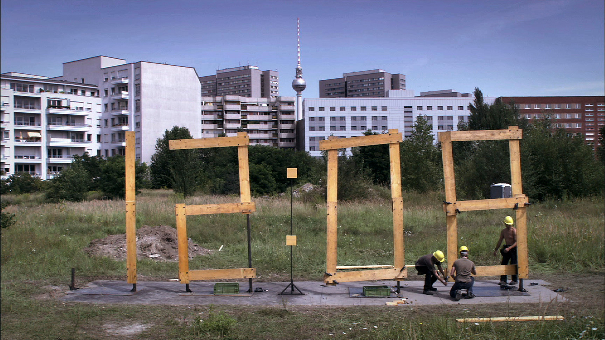

# plasma-wallpaper-standardtime

Video wallpaper plugin for the KDE Plasma 6 lock screen.

The sole function of this plugin is to play the **Standard Time** video - synced to the PC's clock - on the lock screen of a KDE Plasma 6 system.

**Standard Time** is a 24-hour clock, continuously built by a team of people. The video file is exactly 24 hours long.

The video must be bought separately from https://www.standard-time.com/. It comes packaged with a Windows screensaver.

## Installation

Copy the entire directory `com.dllmr.standardtime` into your Plasma wallpapers directory `~/.local/share/plasma/wallpapers`.

Locate the **Standard Time** video file from your purchase. This should be named `st24.mov`.

Copy this file into the directory `~/.local/share/plasma/wallpapers/com.dllmr.standardtime/contents/ui`.

You should now be able to configure your Plasma 6 system to use the **Standard Time** video as your lock screen.

## Alternatives

The code of this plugin has been deliberately engineered to be as minimal as possible. E.g., there are no configuration options at all.

For a much more comprehensive video wallpaper plugin for Plasma 6, please visit https://github.com/luisbocanegra/plasma-smart-video-wallpaper-reborn. This plugin has many more features, although lacks the clock sync ability which is essential for operation of **Standard Time**.
